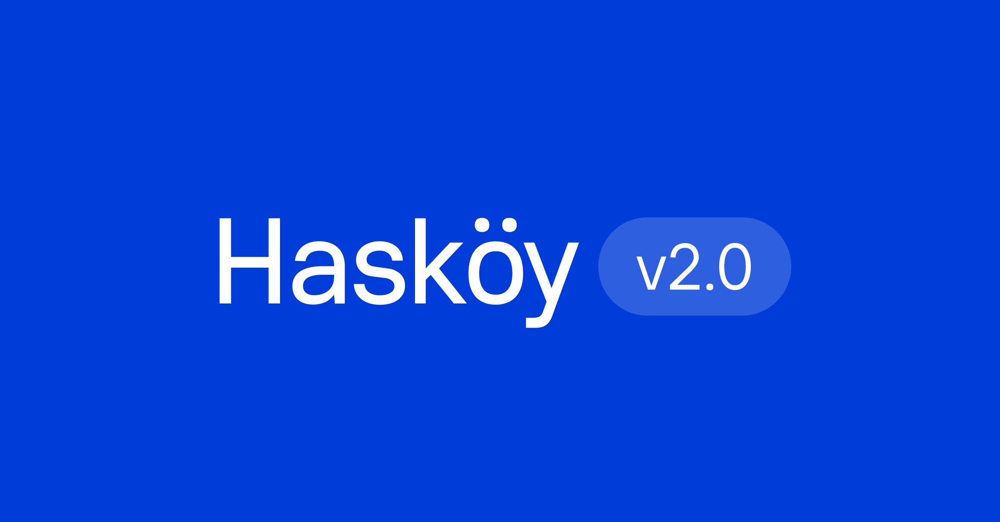

# Hasköy



Hasköy is an open-source variable sans-serif typeface family. Designed with powerful opentype features and each weight includes latin-extended language support, stylistic alternates, fractions, tabular figures, arrows and more. Currently, the family includes Latin Vietnamese, Pinyin, and all Western, Central, and South-Eastern European language support.


## Building the Fonts

Family is built using fontmake and gftools post processing script. Tools are all python based.

To install all the Python tools into a virtualenv, do the following:

```
python3 -m venv venv
source venv/bin/activate
pip install -r requirements.txt
```

Then run the build script in the terminal:

```
cd source
sh build.sh
```

## License

Hasköy is licensed under the SIL Open Font License v1.1, see [OFL.txt](OFL.txt) for details.